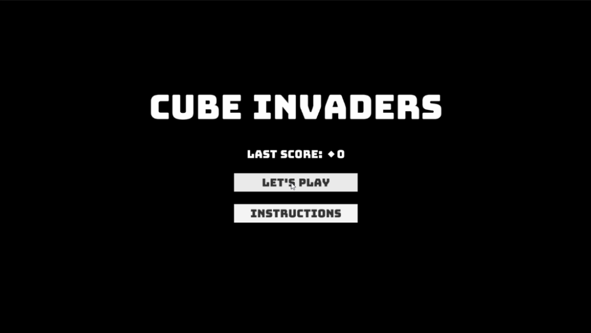
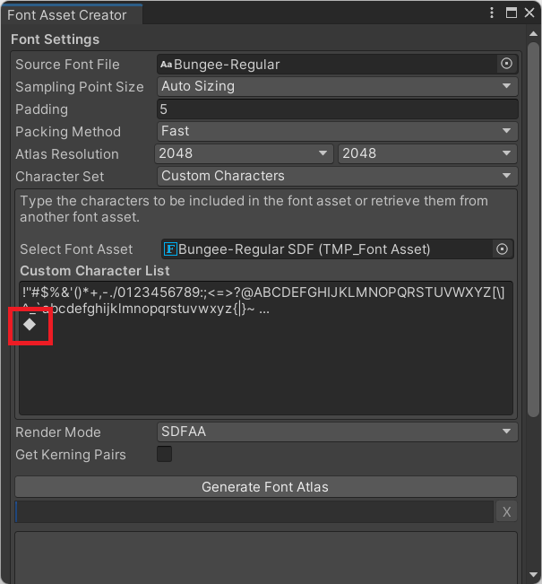
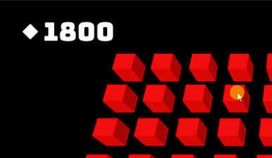
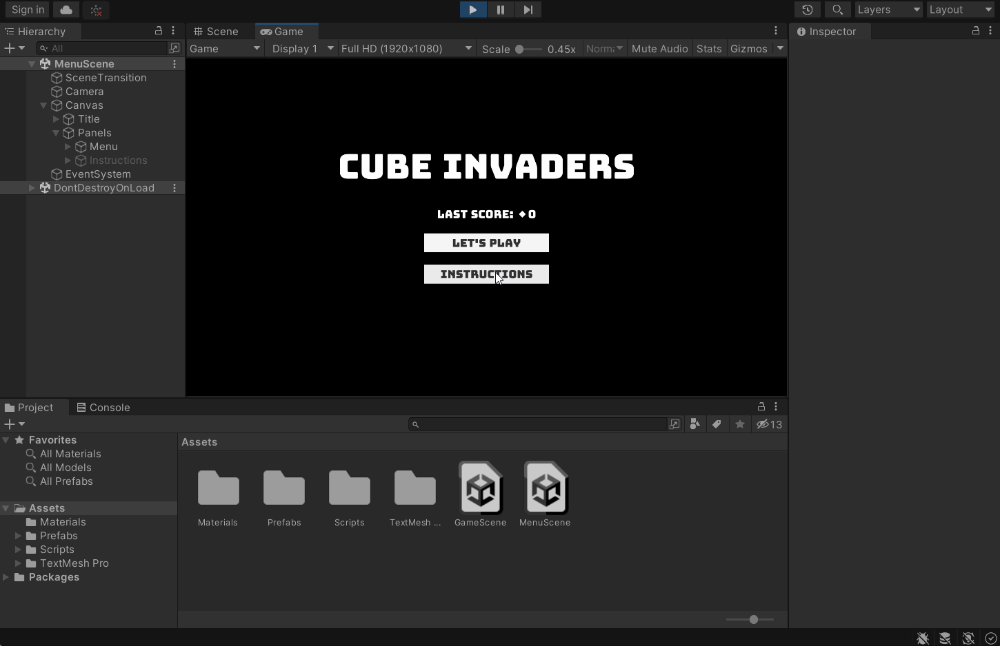
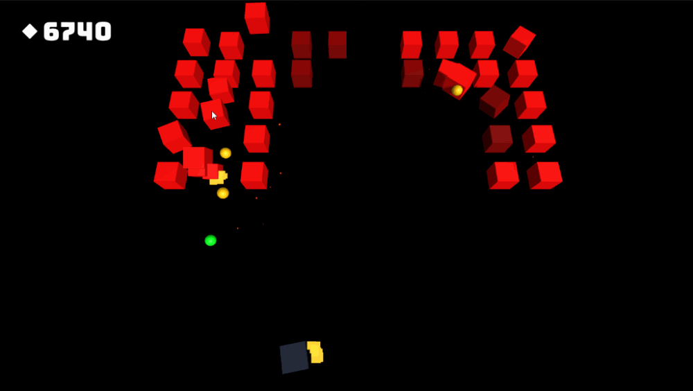
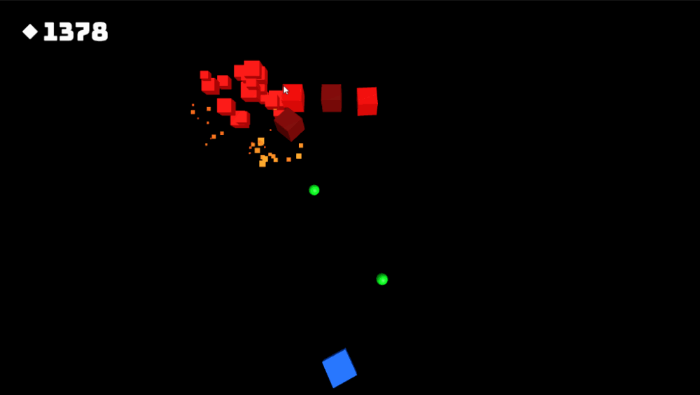

**The University of Melbourne**
# COMP30019 – Graphics and Interaction

## Workshop 11

# Introduction:

In this workshop you will be continuing work on the _Cube Invaders_ game from last time.
You'll add some text to keep track of the player's score, as well as
create a separate title/main menu scene to serve as an "entry point" for the game.

  

> **Note** 
> This repository contains the solution from last week, which is also built upon the
> one prior. You are welcome to work off this repository 
> as a base, or your own solution up until this point. The tasks in this workshop assume
> you understand how everything up until this point works, so it's wise
> to study the solution if you haven't already.

### Tasks:

#### 1. Add some score text

Add some text which tracks the player’s score in the top-left corner of the
viewport. To do this, right click
on the hierarchy and select "UI -> Text - TextMeshPro". As this is the first time you're
creating a TextMesh Pro object, a "TMP Importer" dialog should pop up. Read the information
given, then click "Import TMP Essentials". Before continuing, we recommend you read the
[TextMesh Pro user guide](https://docs.unity3d.com/Packages/com.unity.textmeshpro@3.0/manual/index.html),
and keep it on hand as a reference.

> **Note** 
> TextMesh Pro is technically a separate package in Unity, and you might have noticed there is also an ordinary
> **Text** object template in the UI menu. Either may be used for this task, but TextMesh Pro is generally
> regarded as superior to standard Unity text in terms of both render quality and flexibility.

Consider using an externally sourced font rather than the default one. 
Using a custom font adds an extra layer of visual polish to the game, 
and isn't overly complex to do. Check out [Google fonts](https://fonts.google.com/) for a
great online source of fonts, then, once you download/obtain the respective font file (e.g., `.ttf`)
place it in the project "Assets" folder. Follow 
[this guide](http://digitalnativestudios.com/textmeshpro/docs/font/) to 
generate a TextMesh pro font asset from this file.

#### 2. Track the player's score, and update the text string

Create a "game manager" component that keeps track of the player's score as an integer value (and could be
extended to track other things later). 
If the score integer is changed, the UI text string should update accordingly, based on this integer.
You may use a serialized
[`TMPro.TMP_Text`](https://docs.unity3d.com/Packages/com.unity.textmeshpro@1.0/api/TMPro.TMP_Text.html)
component reference to modify the TextMesh Pro text when required. Prefix the score text with a
a glyph (or word) of your choosing. Note that in the example gifs/images we are using
a diamond glyph (◆), but you don't have to. If you want to attempt this,
it will require you to specify a custom character set when generating
the TextMesh Pro atlas (the font also needs to support the respective character):

  

#### 3. Award some points!

Now increment the score whenever an enemy is destroyed. Create another component
to do this, and attach it to the enemy prefab. Note that the already attached `HealthManager` component has
an `onDeath` event which may be used to trigger a respective "score increment" method.

A key challenge will be referencing
the "game manager" you created earlier to increment the score, since prefabs are
scene-independent. To get around this, you may [tag](https://docs.unity3d.com/Manual/Tags.html) the game manager and use the
method [`GameObject.FindWithTag()`](https://docs.unity3d.com/ScriptReference/GameObject.FindWithTag.html)
to obtain a reference to it dynamically at runtime (e.g. in the `Start()` method). 

> **Note** 
> This is a broader problem that commonly occurs, whereby there is some
> "global" game data which many components depend on.
> Aside from finding a "manager" object reference at runtime, another popular 
> solution is to use the [singleton pattern](https://gamedevbeginner.com/singletons-in-unity-the-right-way/), which allows
> any script to reference the global state implicitly. Be careful here, 
> as globally accessible state 
> can easily come back to bite as the project grows, especially when working in a team!

For an extra challenge, modify the UI text update logic to [lerp](https://docs.unity3d.com/ScriptReference/Mathf.Lerp.html)
towards the actual score over a number of frames, rather than immediately update to the
target score. This is just for a bit of extra polish, and isn't necessary to continue with
the workshop.

  

#### 4. Create a main menu scene

Create a new scene which will serve as
the entry point for the game. Create some centered title/logo text (e.g., "Cube Invaders"), as well
as at least two [buttons](https://docs.unity3d.com/Packages/com.unity.ugui@1.0/manual/UIInteractionComponents.html)
below namely, "Play" and "Instructions". 

When "Play" is clicked, the game scene should be loaded via use of the 
[`SceneManager`](https://docs.unity3d.com/ScriptReference/SceneManagement.SceneManager.html)
class. On the other hand, rather than the "Instructions" button loading a separate scene altogether,
create some instructions text and a "Back" button _on top of_ existing elements. Create a
component that [activates and deactivates](https://docs.unity3d.com/ScriptReference/GameObject.SetActive.html) 
relevant game objects in order to switch between the main menu and the instructions "panel".

Careful use of the object hierarchy can simplify this problem significantly. For example, you can create
two "parent" game objects (under the canvas) that group together elements which should be
activated or deactivated together. Then, simply modify the active state of the parent objects to switch between
the main menu and the instructions. 

> **Note** 
> You might notice that under the automatically created **Canvas** UI parent object, objects have a special type of **Transform** component
> called a **Rect Transform** which is designed for adaptive 2D layouts. 
> It's worth reading the relevant [docs](https://docs.unity3d.com/Packages/com.unity.ugui@1.0/manual/UIBasicLayout.html) here,
> as it's quite feature rich, and may be confusing at first.

  

#### 5. Let the player come full circle!

Nothing currently happens if the player wins (destroys the swarm), or loses (gets destroyed).
Having to restart the game to try again isn't exactly user friendly! Extend the game 
scene such that winning or losing transitions
the player back to the main menu after a short delay. During this delay, some text should show up 
to either congratulate the player for winning, or inform them of the bad news. 

Finally, in the menu scene, add some text that displays the player's last score.
This text should update accordingly upon transitioning back
to the main menu from the game. You will need to think about how to persist data between scenes here.
One approach would be to make the "game manager" component that currently tracks the score 
[not get destroyed upon load](https://docs.unity3d.com/ScriptReference/Object.DontDestroyOnLoad.html). 
Then, if we were to extend the game further, any global state that needs to be accessible between scenes
could also be added to the same manager component.

  

#### 6. Multiple waves (extension)

To add in some difficulty progression, extend the game such that there is more than one wave of
enemy cubes. When a wave is destroyed, the next one should be spawned after a short delay.
Like in the previous task, display some transient status text that informs the player of an incoming
wave of enemies, and/or give them kudos for clearing a wave. 

One approach would be to create copies of the **SwarmManager** object, which
are initially inactive. Create another object/component called **WaveManager** which 
maintains a list of such swarm objects, and queues them up. It should watch for destruction
of the "current" swarm, then activate the next accordingly. This object could also contain a number
of events which may be listened to in order to show/hide/change the status text. Make sure
that each swarm is harder in some way -- feel free to be creative with this!

  

